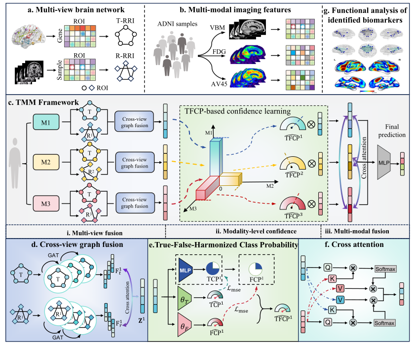

# Trustworthy Enhanced Multi-view Multi-modal Alzheimer’s Disease Prediction with Brain-wide Imaging Transcriptomics Data

## Note
This conference is expanding into journal. In order to protect innovation, the code will not be released now.

# Overview
Brain transcriptomics provides insights into the molecular mechanisms by which the brain coordinates its functions and processes. However, existing multimodal methods for predicting Alzheimer's disease (AD) primarily rely on imaging and sometimes genetic data, often neglecting the transcriptomic basis of brain. Furthermore, while striving to integrate complementary information between modalities, most studies overlook the informativeness disparities between modalities. Here, we propose TMM, a trusted multiview multimodal graph attention framework for AD diagnosis, using extensive brain-wide transcriptomics and imaging data. 



## Requirements

- Python 3.6
- PyTorch 1.10.2
- PyTorch Geometric
- scikit-learn
- numpy

## Data Preparation
The data used can be obtained from ADNI. We provide the data of NC vs. AD.

## Disclaimer
This tool is for research purposes and not approved for clinical use.

## Acknowledgments
This tool is developed in Yao Lab. We thank all the contributors and collaborators for their support.

# Ciatation

If you use this framework in your research, please cite our work:

 ``` 
@article{cong2024trustworthy,
  title={Trustworthy Enhanced Multi-view Multi-modal Alzheimer's Disease Prediction with Brain-wide Imaging Transcriptomics Data},
  author={Cong, Shan and Fan, Zhoujie and Liu, Hongwei and Zhang, Yinghan and Wang, Xin and Luo, Haoran and Yao, Xiaohui},
  journal={arXiv preprint arXiv:2406.14977},
  year={2024}
}
 ``` 


